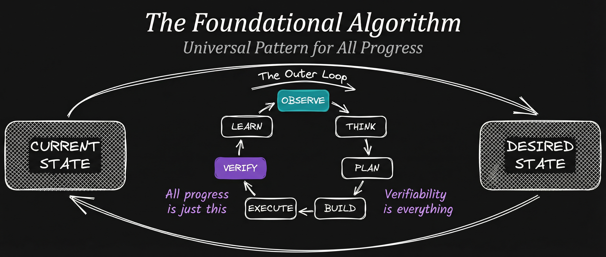

  

# TheAlgorithm

**Version:** 0.1
**Goal:** Produce "Euphoric Surprise" from every response

## Overview

TheAlgorithm is a general problem-solving framework designed to systematically transition from current state to ideal state through verifiable, granular criteria. It serves as the foundation for the PAI (Personal AI Infrastructure) system.

## Core Concept

The most important hill-climbing activity in nature is the transition from **CURRENT STATE** to **IDEAL STATE**. TheAlgorithm operationalizes this through:

1. **Ideal State Criteria (ISC)** - Discrete, granular, binary, testable criteria
2. **Seven-Phase Execution** - Observe, Think, Plan, Build, Execute, Verify, Learn
3. **Euphoric Surprise** - The standard for every output

## Documentation

See [TheAlgorithm.md](./TheAlgorithm.md) for complete methodology and execution format.

## Key Principles

- **Verifiable State:** Everything must have granular, testable criteria
- **Dynamic Maintenance:** ISC evolves with new information throughout execution
- **Hill Climbing:** Iterative improvement toward verified ideal state
- **Scientific Method:** Inner loop mimics observe-hypothesis-test-learn cycles

## Version History

- **v0.1** (2026-01-24) - Initial release

## Links

- **PAI System:** [github.com/danielmiessler/PAI](https://github.com/danielmiessler/PAI)
- **Author:** [Daniel Miessler](https://danielmiessler.com)

---

*"The capture and dynamic maintenance of IDEAL STATE is the single most important activity in the process of hill climbing towards Euphoric Surprise."*
